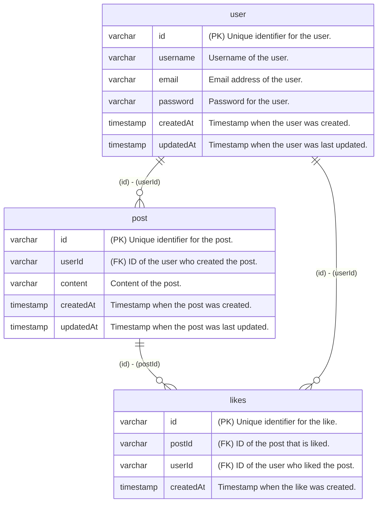

# Sizuku

Welcome to **Sizuku**! This tool takes annotations in your code comments and turns them into useful documentation and validation artifacts automatically. Whether you’re looking to visualize your database schema, generate detailed ER documentation, or create type-safe validation schemas, Sizuku has got you covered.

## What Can Sizuku Do for You?

- **Mermaid ER Diagrams:** Easily see your database tables and how they relate to one another with a clear, visual diagram generated in Mermaid syntax.
- **ER Definitions:** Automatically create comprehensive documentation of your database schema, including detailed column definitions, relationships, and more.
- **Validation Schemas:** Generate type-safe validation schemas using either [Zod](https://zod.dev/) or [Valibot](https://valibot.dev/) based on your code annotations (`@z` for Zod, `@v` for Valibot).
- **Clear Relationship Definitions:** Use the `@relation` annotation in your code to explicitly define how tables are linked (e.g., one-to-many, many-to-many). This ensures that both your ER diagrams and documentation accurately reflect your database relationships.


## Getting Started

### Installation

```bash
npm install -D sizuku
```

## Usage

### Example

input:

```ts
import { sql } from 'drizzle-orm'
import { mysqlTable, varchar, timestamp, unique } from 'drizzle-orm/mysql-core'

export const user = mysqlTable('user', {
  /// Unique identifier for the user.
  /// @z.string().uuid()
  /// @v.pipe(v.string(), v.uuid())
  id: varchar('id', { length: 36 }).primaryKey(),
  /// Username of the user.
  /// @z.string()
  /// @v.string()
  username: varchar('username', { length: 255 }).notNull(),
  /// Email address of the user.
  /// @z.string().email()
  /// @v.pipe(v.string(), v.email())
  email: varchar('email', { length: 255 }).notNull().unique(),
  /// Password for the user.
  /// @z.string().min(8).max(100)
  /// @v.pipe(v.string(), v.minLength(8), v.maxLength(100))
  password: varchar('password', { length: 100 }).notNull(),
  /// Timestamp when the user was created.
  /// @z.date()
  /// @v.date()
  createdAt: timestamp('created_at', { mode: 'string' }).notNull().default(sql`CURRENT_TIMESTAMP`),
  /// Timestamp when the user was last updated.
  /// @z.date()
  /// @v.date()
  updatedAt: timestamp('updated_at', { mode: 'string' })
    .notNull()
    .default(sql`CURRENT_TIMESTAMP`)
    .$onUpdate(() => sql`CURRENT_TIMESTAMP`),
})

/// @relation user.id post.userId one-to-many
export const post = mysqlTable('post', {
  /// Unique identifier for the post.
  /// @z.string().uuid()
  /// @v.pipe(v.string(), v.uuid())
  id: varchar('id', { length: 36 }).primaryKey(),
  /// ID of the user who created the post.
  /// @z.string().uuid()
  /// @v.pipe(v.string(), v.uuid())
  userId: varchar('user_id', { length: 36 })
    .notNull()
    .references(() => user.id, { onDelete: 'cascade' }),
  /// Content of the post.
  /// @z.string()
  /// @v.string()
  content: varchar('content', { length: 500 }).notNull(),
  /// Timestamp when the post was created.
  /// @z.date()
  /// @v.date()
  createdAt: timestamp('created_at', { mode: 'string' }).notNull().default(sql`CURRENT_TIMESTAMP`),
  /// Timestamp when the post was last updated.
  /// @z.date()
  /// @v.date()
  updatedAt: timestamp('updated_at', { mode: 'string' })
    .notNull()
    .default(sql`CURRENT_TIMESTAMP`)
    .$onUpdate(() => sql`CURRENT_TIMESTAMP`),
})

/// @relation post.id likes.postId one-to-many
/// @relation user.id likes.userId one-to-many
export const likes = mysqlTable(
  'likes',
  {
    /// Unique identifier for the like.
    /// @z.string().uuid()
    /// @v.pipe(v.string(), v.uuid())
    id: varchar('id', { length: 36 }).primaryKey(),
    /// ID of the post that is liked.
    /// @z.string().uuid()
    /// @v.pipe(v.string(), v.uuid())
    postId: varchar('post_id', { length: 36 })
      .notNull()
      .references(() => post.id, { onDelete: 'cascade' }),
    /// ID of the user who liked the post.
    /// @z.string().uuid()
    /// @v.pipe(v.string(), v.uuid())
    userId: varchar('user_id', { length: 36 })
      .notNull()
      .references(() => user.id, { onDelete: 'cascade' }),
    /// Timestamp when the like was created.
    /// @z.date()
    /// @v.date()
    createdAt: timestamp('created_at', { mode: 'string' })
      .notNull()
      .default(sql`CURRENT_TIMESTAMP`),
  },
  (t) => [unique().on(t.userId, t.postId)],
)
```

### Mermaid ER

```bash
npx sizuku-mermaid-er path/to/db/schema.ts -o path/to/output.md
```

output:



### Zod

```bash
npx sizuku-zod path/to/db/schema.ts -o path/to/output.ts
```

output:

```ts
import { z } from 'zod'

export const UserSchema = z.object({
  /**
   * Unique identifier for the user.
   */
  id: z.string().uuid(),
  /**
   * Username of the user.
   */
  username: z.string(),
  /**
   * Email address of the user.
   */
  email: z.string().email(),
  /**
   * Password for the user.
   */
  password: z.string().min(8).max(100),
  /**
   * Timestamp when the user was created.
   */
  createdAt: z.date(),
  /**
   * Timestamp when the user was last updated.
   */
  updatedAt: z.date(),
})

export const PostSchema = z.object({
  /**
   * Unique identifier for the post.
   */
  id: z.string().uuid(),
  /**
   * ID of the user who created the post.
   */
  userId: z.string().uuid(),
  /**
   * Content of the post.
   */
  content: z.string(),
  /**
   * Timestamp when the post was created.
   */
  createdAt: z.date(),
  /**
   * Timestamp when the post was last updated.
   */
  updatedAt: z.date(),
})

export const LikesSchema = z.object({
  /**
   * Unique identifier for the like.
   */
  id: z.string().uuid(),
  /**
   * ID of the post that is liked.
   */
  postId: z.string().uuid(),
  /**
   * ID of the user who liked the post.
   */
  userId: z.string().uuid(),
  /**
   * Timestamp when the like was created.
   */
  createdAt: z.date(),
})
```

### Valibot

```bash
npx sizuku-valibot path/to/db/schema.ts -o path/to/output.ts
```

output:

```ts
import * as v from 'valibot'

export const UserSchema = v.object({
  /**
   * Unique identifier for the user.
   */
  id: v.pipe(v.string(), v.uuid()),
  /**
   * Username of the user.
   */
  username: v.string(),
  /**
   * Email address of the user.
   */
  email: v.pipe(v.string(), v.email()),
  /**
   * Password for the user.
   */
  password: v.pipe(v.string(), v.minLength(8), v.maxLength(100)),
  /**
   * Timestamp when the user was created.
   */
  createdAt: v.date(),
  /**
   * Timestamp when the user was last updated.
   */
  updatedAt: v.date(),
})

export const PostSchema = v.object({
  /**
   * Unique identifier for the post.
   */
  id: v.pipe(v.string(), v.uuid()),
  /**
   * ID of the user who created the post.
   */
  userId: v.pipe(v.string(), v.uuid()),
  /**
   * Content of the post.
   */
  content: v.string(),
  /**
   * Timestamp when the post was created.
   */
  createdAt: v.date(),
  /**
   * Timestamp when the post was last updated.
   */
  updatedAt: v.date(),
})

export const LikesSchema = v.object({
  /**
   * Unique identifier for the like.
   */
  id: v.pipe(v.string(), v.uuid()),
  /**
   * ID of the post that is liked.
   */
  postId: v.pipe(v.string(), v.uuid()),
  /**
   * ID of the user who liked the post.
   */
  userId: v.pipe(v.string(), v.uuid()),
  /**
   * Timestamp when the like was created.
   */
  createdAt: v.date(),
})
```

## Configuration

### sizuku-mermaid-er.json

| Option | Type | Default | Description |
|--------|------|---------|-------------|
| `input` | `string` | `""` | Input file path |
| `output` | `string` | `""` | Output file path |

> **⚠️** When using a configuration file, command line arguments are not required. The configuration file settings take precedence over command line arguments.
>
> When you have configured `sizuku-mermaid-er.json`, you can simply run:
> ```bash
> npx sizuku-mermaid-er
> ```

#### Example

```json
{
  "input": "db/schema.ts",
  "output": "mermaid-er/ER.md"
}
```

### sizuku-zod.json

#### Schema Options

| Option | Type | Default | Description |
|--------|------|---------|-------------|
| `name` | `"PascalCase"` \| `"camelCase"` | `"PascalCase"` | Naming convention for generated schema variables |
| `export` | `boolean` | `false` | When true, exports all schema definitions |

#### Type Options

| Option | Type | Default | Description |
|--------|------|---------|-------------|
| `name` | `"PascalCase"` \| `"camelCase"` | `"PascalCase"` | Naming convention for generated type definitions |
| `export` | `boolean` | `false` | When true, exports all type definitions |

#### Comment Options

| Option | Type | Default | Description |
|--------|------|---------|-------------|
| `name` | `boolean` | `false` | If enabled, includes the element's original name in TSDoc comments. |

#### Input and Output

| Option | Type | Default | Description |
|--------|------|---------|-------------|
| `input` | `string` | `""` | Input file path |
| `output` | `string` | `""` | Output file path |

#### Example

```json
{
  "schema": {
    "name": "PascalCase"
  },
  "type": {
    "name": "PascalCase",
    "export": false
  },
  "comment": true,
  "input": "db/schema.ts",
  "output": "zod/index.ts"
}
```

> **⚠️** When using a configuration file, command line arguments are not required. The configuration file settings take precedence over command line arguments.
>
> When you have configured `sizuku-zod.json`, you can simply run:
> ```bash
> npx sizuku-zod
> ```

### sizuku-valibot.json

#### Schema Options

| Option | Type | Default | Description |
|--------|------|---------|-------------|
| `name` | `"PascalCase"` \| `"camelCase"` | `"PascalCase"` | Naming convention for generated schema variables |
| `export` | `boolean` | `false` | When true, exports all schema definitions |

#### Type Options

| Option | Type | Default | Description |
|--------|------|---------|-------------|
| `name` | `"PascalCase"` \| `"camelCase"` | `"PascalCase"` | Naming convention for generated type definitions |
| `export` | `boolean` | `false` | When true, exports all type definitions |

#### Comment Options

| Option | Type | Default | Description |
|--------|------|---------|-------------|
| `name` | `boolean` | `false` | If enabled, includes the element's original name in TSDoc comments. |

#### Input and Output

| Option | Type | Default | Description |
|--------|------|---------|-------------|
| `input` | `string` | `""` | Input file path |
| `output` | `string` | `""` | Output file path |

#### Examples

```json
{
  "schema": {
    "name": "PascalCase"
  },
  "type": {
    "name": "PascalCase",
    "export": false
  },
  "comment": true,
  "input": "db/schema.ts",
  "output": "valibot/index.ts"
}
```

> **⚠️** When using a configuration file, command line arguments are not required. The configuration file settings take precedence over command line arguments.
>
> When you have configured `sizuku-zod.json`, you can simply run:
> ```bash
> npx sizuku-valibot
> ```

This project is in **early development** and being maintained by a developer with about 2 years of experience. While I'm doing my best to create a useful tool:

### ⚠️ WARNING: Potential Breaking Changes Without Notice

**This package is in active development and may introduce breaking changes without prior notice.**
Specifically:
- Query parameter coercion behavior may change
- Schema generation logic might be updated
- Output code structure could be modified
- Example value handling might be altered

We strongly recommend:
- Pinning to exact versions in production
- Testing thoroughly when updating versions
- Reviewing generated code after updates

We welcome feedback and contributions to improve the tool!

## License

Distributed under the MIT License. See [LICENSE](https://github.com/nakita628/hono-takibi?tab=MIT-1-ov-file) for more information.