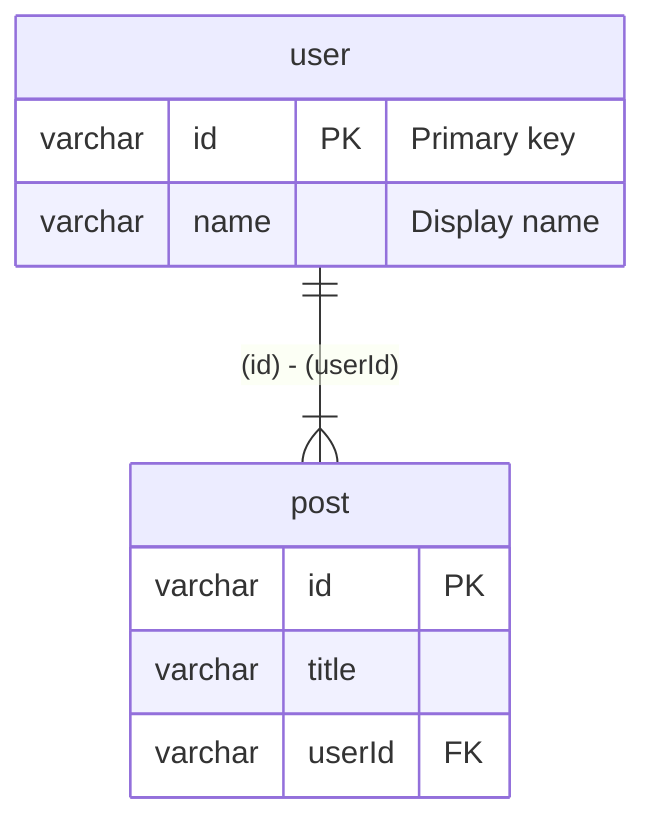

# Sizuku

**[Sizuku](https://www.npmjs.com/package/sizuku)** is a CLI tool that generates validation schemas for Zod, Valibot, ArkType, and Effect Schema, as well as ER diagrams, from [Drizzle](https://orm.drizzle.team/) schemas.

## Features

- 💎 Generates [Zod](https://zod.dev/) schemas from your Drizzle schema
- 🤖 Generates [Valibot](https://valibot.dev/) schemas from your Drizzle schema
- 🏹 Generates [ArkType](https://arktype.io/) schemas from your Drizzle schema
- ⚡ Generates [Effect Schema](https://effect.website/docs/schema/introduction/) from your Drizzle schema
- 📊 Creates [Mermaid](https://mermaid.js.org/) ER diagrams
- 📝 Generates [DBML](https://dbml.dbdiagram.io/) (Database Markup Language) files
- 🖼️ Outputs ER diagrams as **PNG** images

## Installation

```bash
npm install -D sizuku
```

## Usage

```
sizuku <input> -o <output> [options]
```

### Options

```
-o <path>                         Output file path
--zod                             Generate Zod validation schema
--valibot                         Generate Valibot validation schema
--arktype                         Generate ArkType validation schema
--effect                          Generate Effect Schema validation schema
--zod-version <version>           Zod variant: 'v4' | 'mini' | '@hono/zod-openapi'
--no-export-types                 Do not export inferred types
--no-with-comment                 Do not add JSDoc comments
--no-with-relation                Do not generate relation schemas
-h, --help                        Display help message
```

### Quick Start

```sh
# Generate Zod schema
npx sizuku db/schema.ts -o zod/index.ts --zod

# Generate Valibot schema
npx sizuku db/schema.ts -o valibot/index.ts --valibot

# Generate DBML
npx sizuku db/schema.ts -o docs/schema.dbml

# Generate ER diagram PNG
npx sizuku db/schema.ts -o docs/er.png

# Generate Mermaid ER diagram
npx sizuku db/schema.ts -o docs/ER.md
```

## Schema Annotations

Add `///` comments to your Drizzle schema fields with library-specific annotations:

```ts
import { relations } from "drizzle-orm";
import { mysqlTable, varchar } from "drizzle-orm/mysql-core";

export const user = mysqlTable("user", {
  /// Primary key
  /// @z.uuid()
  /// @v.pipe(v.string(), v.uuid())
  /// @a."string.uuid"
  /// @e.Schema.UUID
  id: varchar("id", { length: 36 }).primaryKey(),
  /// Display name
  /// @z.string().min(1).max(50)
  /// @v.pipe(v.string(), v.minLength(1), v.maxLength(50))
  /// @a."1 <= string <= 50"
  /// @e.Schema.String.pipe(Schema.minLength(1), Schema.maxLength(50))
  name: varchar("name", { length: 50 }).notNull(),
});

export const post = mysqlTable("post", {
  /// @z.uuid()
  /// @v.pipe(v.string(), v.uuid())
  /// @a."string.uuid"
  /// @e.Schema.UUID
  id: varchar("id", { length: 36 }).primaryKey(),
  /// @z.string().min(1).max(100)
  /// @v.pipe(v.string(), v.minLength(1), v.maxLength(100))
  /// @a."1 <= string <= 100"
  /// @e.Schema.String.pipe(Schema.minLength(1), Schema.maxLength(100))
  title: varchar("title", { length: 100 }).notNull(),
  /// @z.uuid()
  /// @v.pipe(v.string(), v.uuid())
  /// @a."string.uuid"
  /// @e.Schema.UUID
  userId: varchar("user_id", { length: 36 })
    .notNull()
    .references(() => user.id),
});

export const userRelations = relations(user, ({ many }) => ({
  posts: many(post),
}));

export const postRelations = relations(post, ({ one }) => ({
  user: one(user, {
    fields: [post.userId],
    references: [user.id],
  }),
}));
```

Annotations are optional. Generators work without them (DBML/Mermaid don't need annotations at all).

## Output Examples

### Zod

```sh
npx sizuku db/schema.ts -o zod/index.ts --zod
```

```ts
import * as z from "zod";

export const UserSchema = z.object({
  /**
   * Primary key
   */
  id: z.uuid(),
  /**
   * Display name
   */
  name: z.string().min(1).max(50),
});

export type User = z.infer<typeof UserSchema>;

export const UserRelationsSchema = z.object({
  ...UserSchema.shape,
  posts: z.array(PostSchema),
});

export type UserRelations = z.infer<typeof UserRelationsSchema>;
```

### Valibot

```sh
npx sizuku db/schema.ts -o valibot/index.ts --valibot
```

```ts
import * as v from "valibot";

export const UserSchema = v.object({
  /**
   * Primary key
   */
  id: v.pipe(v.string(), v.uuid()),
  /**
   * Display name
   */
  name: v.pipe(v.string(), v.minLength(1), v.maxLength(50)),
});

export type User = v.InferOutput<typeof UserSchema>;

export const UserRelationsSchema = v.object({
  ...UserSchema.entries,
  posts: v.array(PostSchema),
});

export type UserRelations = v.InferOutput<typeof UserRelationsSchema>;
```

### ArkType

```sh
npx sizuku db/schema.ts -o arktype/index.ts --arktype
```

```ts
import { type } from "arktype";

export const UserSchema = type({
  /**
   * Primary key
   */
  id: "string.uuid",
  /**
   * Display name
   */
  name: "1 <= string <= 50",
});

export type User = typeof UserSchema.infer;
```

### Effect Schema

```sh
npx sizuku db/schema.ts -o effect/index.ts --effect
```

```ts
import { Schema } from "effect";

export const UserSchema = Schema.Struct({
  /**
   * Primary key
   */
  id: Schema.UUID,
  /**
   * Display name
   */
  name: Schema.String.pipe(Schema.minLength(1), Schema.maxLength(50)),
});

export type UserEncoded = typeof UserSchema.Encoded;
```

### DBML

```sh
npx sizuku db/schema.ts -o docs/schema.dbml
```

```dbml
Table user {
  id varchar [pk, note: 'Primary key']
  name varchar [note: 'Display name']
}

Table post {
  id varchar [pk]
  title varchar
  userId varchar
}

Ref post_userId_user_id_fk: post.userId > user.id
```

### Mermaid ER

```sh
npx sizuku db/schema.ts -o docs/ER.md
```


```mermaid
erDiagram
    user ||--}| post : "(id) - (userId)"
    user {
        varchar id PK "Primary key"
        varchar name "Display name"
    }
    post {
        varchar id PK
        varchar title
        varchar userId FK
    }
```

## Relation Detection

Sizuku detects relations from three sources:

### 1. `.references()` chain

```ts
userId: varchar("user_id").references(() => user.id);
```

### 2. `foreignKey()` constraint

```ts
export const post = pgTable('post', { ... }, (t) => ({
  fk: foreignKey({ columns: [t.userId], foreignColumns: [user.id] }),
}))
```

### 3. `relations()` block

```ts
export const postRelations = relations(post, ({ one }) => ({
  user: one(user, { fields: [post.userId], references: [user.id] }),
}));
```

## License

Distributed under the MIT License. See [LICENSE](https://github.com/nakita628/sizuku?tab=MIT-1-ov-file) for more information.
