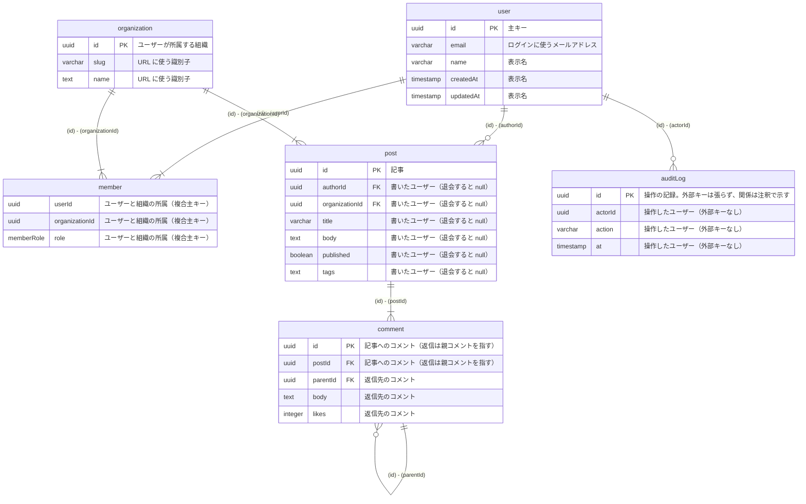

```mermaid
erDiagram
    user ||--|{ member : "(id) - (userId)"
    organization ||--|{ member : "(id) - (organizationId)"
    user ||--o{ post : "(id) - (authorId)"
    organization ||--|{ post : "(id) - (organizationId)"
    post ||--|{ comment : "(id) - (postId)"
    comment ||--o{ comment : "(id) - (parentId)"
    user ||--o{ auditLog : "(id) - (actorId)"
    user {
        uuid id PK "主キー"
        varchar email "ログインに使うメールアドレス"
        varchar name "表示名"
        timestamp createdAt "表示名"
        timestamp updatedAt "表示名"
    }
    organization {
        uuid id PK "ユーザーが所属する組織"
        varchar slug "URL に使う識別子"
        text name "URL に使う識別子"
    }
    member {
        uuid userId "ユーザーと組織の所属（複合主キー）"
        uuid organizationId "ユーザーと組織の所属（複合主キー）"
        memberRole role "ユーザーと組織の所属（複合主キー）"
    }
    post {
        uuid id PK "記事"
        uuid authorId FK "書いたユーザー（退会すると null）"
        uuid organizationId FK "書いたユーザー（退会すると null）"
        varchar title "書いたユーザー（退会すると null）"
        text body "書いたユーザー（退会すると null）"
        boolean published "書いたユーザー（退会すると null）"
        text tags "書いたユーザー（退会すると null）"
    }
    comment {
        uuid id PK "記事へのコメント（返信は親コメントを指す）"
        uuid postId FK "記事へのコメント（返信は親コメントを指す）"
        uuid parentId FK "返信先のコメント"
        text body "返信先のコメント"
        integer likes "返信先のコメント"
    }
    auditLog {
        uuid id PK "操作の記録。外部キーは張らず、関係は注釈で示す"
        uuid actorId "操作したユーザー（外部キーなし）"
        varchar action "操作したユーザー（外部キーなし）"
        timestamp at "操作したユーザー（外部キーなし）"
    }
```
