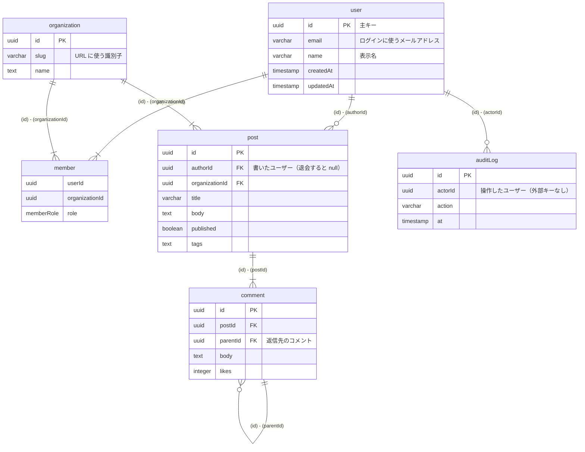

```mermaid
erDiagram
    user ||--|{ member : "(id) - (userId)"
    organization ||--|{ member : "(id) - (organizationId)"
    user ||--o{ post : "(id) - (authorId)"
    organization ||--|{ post : "(id) - (organizationId)"
    post ||--|{ comment : "(id) - (postId)"
    comment ||--o{ comment : "(id) - (parentId)"
    user ||--o{ auditLog : "(id) - (actorId)"
    user {
        uuid id PK "主キー"
        varchar email "ログインに使うメールアドレス"
        varchar name "表示名"
        timestamp createdAt
        timestamp updatedAt
    }
    organization {
        uuid id PK
        varchar slug "URL に使う識別子"
        text name
    }
    member {
        uuid userId
        uuid organizationId
        memberRole role
    }
    post {
        uuid id PK
        uuid authorId FK "書いたユーザー（退会すると null）"
        uuid organizationId FK
        varchar title
        text body
        boolean published
        text tags
    }
    comment {
        uuid id PK
        uuid postId FK
        uuid parentId FK "返信先のコメント"
        text body
        integer likes
    }
    auditLog {
        uuid id PK
        uuid actorId "操作したユーザー（外部キーなし）"
        varchar action
        timestamp at
    }
```
