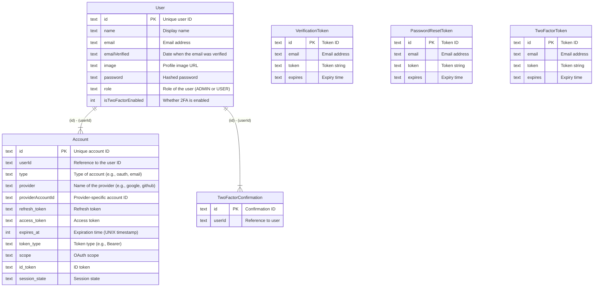

```mermaid
erDiagram
    User ||--}| Account : "(id) - (userId)"
    User ||--}| TwoFactorConfirmation : "(id) - (userId)"
    User {
        text id PK "Unique user ID"
        text name "Display name"
        text email "Email address"
        text emailVerified "Date when the email was verified"
        text image "Profile image URL"
        text password "Hashed password"
        text role "Role of the user (ADMIN or USER)"
        int isTwoFactorEnabled "Whether 2FA is enabled"
    }
    Account {
        text id PK "Unique account ID"
        text userId "Reference to the user ID"
        text type "Type of account (e.g., oauth, email)"
        text provider "Name of the provider (e.g., google, github)"
        text providerAccountId "Provider-specific account ID"
        text refresh_token "Refresh token"
        text access_token "Access token"
        int expires_at "Expiration time (UNIX timestamp)"
        text token_type "Token type (e.g., Bearer)"
        text scope "OAuth scope"
        text id_token "ID token"
        text session_state "Session state"
    }
    VerificationToken {
        text id PK "Token ID"
        text email "Email address"
        text token "Token string"
        text expires "Expiry time"
    }
    PasswordResetToken {
        text id PK "Token ID"
        text email "Email address"
        text token "Token string"
        text expires "Expiry time"
    }
    TwoFactorToken {
        text id PK "Token ID"
        text email "Email address"
        text token "Token string"
        text expires "Expiry time"
    }
    TwoFactorConfirmation {
        text id PK "Confirmation ID"
        text userId "Reference to user"
    }
```