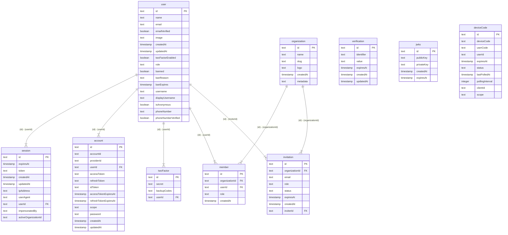

```mermaid
erDiagram
    user ||--}| session : "(id) - (userId)"
    user ||--}| account : "(id) - (userId)"
    user ||--}| twoFactor : "(id) - (userId)"
    organization ||--}| member : "(id) - (organizationId)"
    user ||--}| member : "(id) - (userId)"
    organization ||--}| invitation : "(id) - (organizationId)"
    user ||--}| invitation : "(id) - (inviterId)"
    user {
        text id PK
        text name
        text email
        boolean emailVerified
        text image
        timestamp createdAt
        timestamp updatedAt
        boolean twoFactorEnabled
        text role
        boolean banned
        text banReason
        timestamp banExpires
        text username
        text displayUsername
        boolean isAnonymous
        text phoneNumber
        boolean phoneNumberVerified
    }
    session {
        text id PK
        timestamp expiresAt
        text token
        timestamp createdAt
        timestamp updatedAt
        text ipAddress
        text userAgent
        text userId FK
        text impersonatedBy
        text activeOrganizationId
    }
    account {
        text id PK
        text accountId
        text providerId
        text userId FK
        text accessToken
        text refreshToken
        text idToken
        timestamp accessTokenExpiresAt
        timestamp refreshTokenExpiresAt
        text scope
        text password
        timestamp createdAt
        timestamp updatedAt
    }
    verification {
        text id PK
        text identifier
        text value
        timestamp expiresAt
        timestamp createdAt
        timestamp updatedAt
    }
    twoFactor {
        text id PK
        text secret
        text backupCodes
        text userId FK
    }
    organization {
        text id PK
        text name
        text slug
        text logo
        timestamp createdAt
        text metadata
    }
    member {
        text id PK
        text organizationId FK
        text userId FK
        text role
        timestamp createdAt
    }
    invitation {
        text id PK
        text organizationId FK
        text email
        text role
        text status
        timestamp expiresAt
        timestamp createdAt
        text inviterId FK
    }
    jwks {
        text id PK
        text publicKey
        text privateKey
        timestamp createdAt
        timestamp expiresAt
    }
    deviceCode {
        text id PK
        text deviceCode
        text userCode
        text userId
        timestamp expiresAt
        text status
        timestamp lastPolledAt
        integer pollingInterval
        text clientId
        text scope
    }
```
