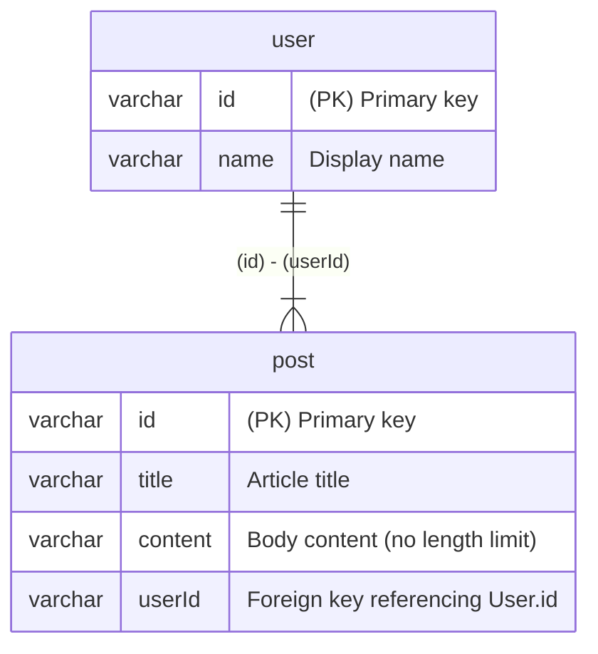

```mermaid
erDiagram
    user ||--}| post : "(id) - (userId)"
    user {
        varchar id "(PK) Primary key"
        varchar name "Display name"
    }
    post {
        varchar id "(PK) Primary key"
        varchar title "Article title"
        varchar content "Body content (no length limit)"
        varchar userId "Foreign key referencing User.id"
    }
```