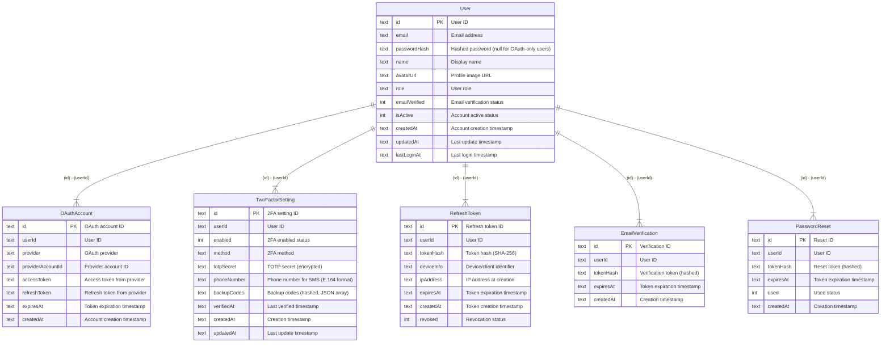

```mermaid
erDiagram
    User ||--}| OAuthAccount : "(id) - (userId)"
    User ||--}| TwoFactorSetting : "(id) - (userId)"
    User ||--}| RefreshToken : "(id) - (userId)"
    User ||--}| EmailVerification : "(id) - (userId)"
    User ||--}| PasswordReset : "(id) - (userId)"
    User {
        text id PK "User ID"
        text email "Email address"
        text passwordHash "Hashed password (null for OAuth-only users)"
        text name "Display name"
        text avatarUrl "Profile image URL"
        text role "User role"
        int emailVerified "Email verification status"
        int isActive "Account active status"
        text createdAt "Account creation timestamp"
        text updatedAt "Last update timestamp"
        text lastLoginAt "Last login timestamp"
    }
    OAuthAccount {
        text id PK "OAuth account ID"
        text userId "User ID"
        text provider "OAuth provider"
        text providerAccountId "Provider account ID"
        text accessToken "Access token from provider"
        text refreshToken "Refresh token from provider"
        text expiresAt "Token expiration timestamp"
        text createdAt "Account creation timestamp"
    }
    TwoFactorSetting {
        text id PK "2FA setting ID"
        text userId "User ID"
        int enabled "2FA enabled status"
        text method "2FA method"
        text totpSecret "TOTP secret (encrypted)"
        text phoneNumber "Phone number for SMS (E.164 format)"
        text backupCodes "Backup codes (hashed, JSON array)"
        text verifiedAt "Last verified timestamp"
        text createdAt "Creation timestamp"
        text updatedAt "Last update timestamp"
    }
    RefreshToken {
        text id PK "Refresh token ID"
        text userId "User ID"
        text tokenHash "Token hash (SHA-256)"
        text deviceInfo "Device/client identifier"
        text ipAddress "IP address at creation"
        text expiresAt "Token expiration timestamp"
        text createdAt "Token creation timestamp"
        int revoked "Revocation status"
    }
    EmailVerification {
        text id PK "Verification ID"
        text userId "User ID"
        text tokenHash "Verification token (hashed)"
        text expiresAt "Token expiration timestamp"
        text createdAt "Creation timestamp"
    }
    PasswordReset {
        text id PK "Reset ID"
        text userId "User ID"
        text tokenHash "Reset token (hashed)"
        text expiresAt "Token expiration timestamp"
        int used "Used status"
        text createdAt "Creation timestamp"
    }
```