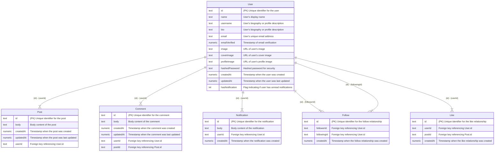

```mermaid
erDiagram
    User ||--}| Post : "(id) - (userId)"
    User ||--}| Comment : "(id) - (userId)"
    User ||--}| Notification : "(id) - (userId)"
    User ||--}| Follow : "(id) - (followerId)"
    User ||--}| Follow : "(id) - (followingId)"
    User ||--}| Like : "(id) - (userId)"
    User {
        text id "(PK) Unique identifier for the user"
        text name "User's display name"
        text username "User's biography or profile description"
        text bio "User's biography or profile description"
        text email "User's unique email address"
        numeric emailVerified "Timestamp of email verification"
        text image "URL of user's image"
        text coverImage "URL of user's cover image"
        text profileImage "URL of user's profile image"
        text hashedPassword "Hashed password for security"
        numeric createdAt "Timestamp when the user was created"
        numeric updatedAt "Timestamp when the user was last updated"
        int hasNotification "Flag indicating if user has unread notifications"
    }
    Post {
        text id "(PK) Unique identifier for the post"
        text body "Body content of the post"
        numeric createdAt "Timestamp when the post was created"
        numeric updatedAt "Timestamp when the post was last updated"
        text userId "Foreign key referencing User.id"
    }
    Follow {
        text id "(PK) Unique identifier for the follow relationship"
        text followerId "Foreign key referencing User.id"
        text followingId "Foreign key referencing User.id"
        numeric createdAt "Timestamp when the follow relationship was created"
    }
    Like {
        text id "(PK) Unique identifier for the like relationship"
        text userId "Foreign key referencing User.id"
        text postId "Foreign key referencing Post.id"
        numeric createdAt "Timestamp when the like relationship was created"
    }
    Comment {
        text id "(PK) Unique identifier for the comment"
        text body "Body content of the comment"
        numeric createdAt "Timestamp when the comment was created"
        numeric updatedAt "Timestamp when the comment was last updated"
        text userId "Foreign key referencing User.id"
        text postId "Foreign key referencing Post.id"
    }
    Notification {
        text id "(PK) Unique identifier for the notification"
        text body "Body content of the notification"
        text userId "Foreign key referencing User.id"
        numeric createdAt "Timestamp when the notification was created"
    }
```