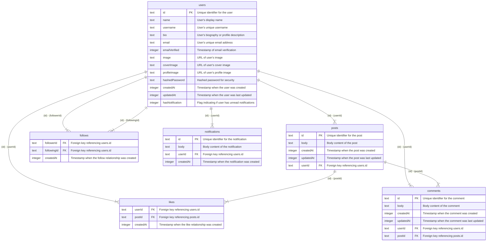

```mermaid
erDiagram
    users ||--}| posts : "(id) - (userId)"
    users ||--}| follows : "(id) - (followerId)"
    users ||--}| follows : "(id) - (followingId)"
    users ||--}| likes : "(id) - (userId)"
    posts ||--}| likes : "(id) - (postId)"
    users ||--}| comments : "(id) - (userId)"
    posts ||--}| comments : "(id) - (postId)"
    users ||--}| notifications : "(id) - (userId)"
    users {
        text id PK "Unique identifier for the user"
        text name "User's display name"
        text username "User's unique username"
        text bio "User's biography or profile description"
        text email "User's unique email address"
        integer emailVerified "Timestamp of email verification"
        text image "URL of user's image"
        text coverImage "URL of user's cover image"
        text profileImage "URL of user's profile image"
        text hashedPassword "Hashed password for security"
        integer createdAt "Timestamp when the user was created"
        integer updatedAt "Timestamp when the user was last updated"
        integer hasNotification "Flag indicating if user has unread notifications"
    }
    posts {
        text id PK "Unique identifier for the post"
        text body "Body content of the post"
        integer createdAt "Timestamp when the post was created"
        integer updatedAt "Timestamp when the post was last updated"
        text userId FK "Foreign key referencing users.id"
    }
    follows {
        text followerId FK "Foreign key referencing users.id"
        text followingId FK "Foreign key referencing users.id"
        integer createdAt "Timestamp when the follow relationship was created"
    }
    likes {
        text userId FK "Foreign key referencing users.id"
        text postId FK "Foreign key referencing posts.id"
        integer createdAt "Timestamp when the like relationship was created"
    }
    comments {
        text id PK "Unique identifier for the comment"
        text body "Body content of the comment"
        integer createdAt "Timestamp when the comment was created"
        integer updatedAt "Timestamp when the comment was last updated"
        text userId FK "Foreign key referencing users.id"
        text postId FK "Foreign key referencing posts.id"
    }
    notifications {
        text id PK "Unique identifier for the notification"
        text body "Body content of the notification"
        text userId FK "Foreign key referencing users.id"
        integer createdAt "Timestamp when the notification was created"
    }
```