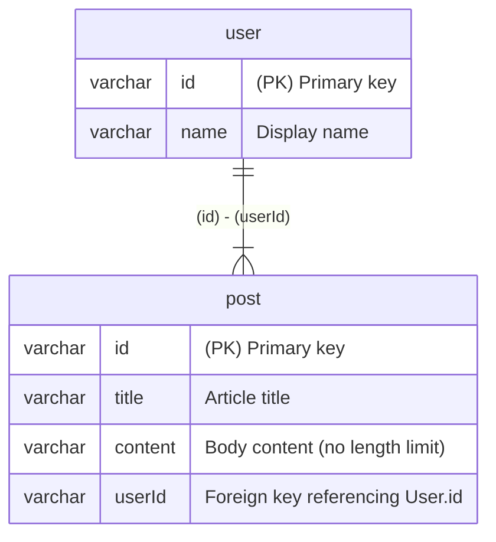

# Sizuku

**[Sizuku](https://www.npmjs.com/package/sizuku)** is a tool that generates validation schemas for Zod, Valibot, ArkType, and Effect Schema, as well as ER diagrams, from [Drizzle](https://orm.drizzle.team/) schemas.

## Features

- 💎 Automatically generates [Zod](https://zod.dev/) schemas from your Drizzle schema
- 🤖 Automatically generates [Valibot](https://valibot.dev/) schemas from your Drizzle schema
- 🏹 Automatically generates [ArkType](https://arktype.io/) schemas from your Drizzle schema
- ⚡ Automatically generates [Effect Schema](https://effect.website/docs/schema/introduction/) from your Drizzle schema
- 📊 Creates [Mermaid](https://mermaid.js.org/) ER diagrams
- 📝 Generates [DBML](https://dbml.dbdiagram.io/) (Database Markup Language) files
- 🖼️ Outputs ER diagrams as **PNG** images using [dbml-renderer](https://github.com/softwaretechnik-berlin/dbml-renderer)

## Getting Started

### Installation

```bash
npm install -D sizuku
```

## Usage

### Example

Prepare schema.ts:

```ts
import { relations } from 'drizzle-orm'
import { mysqlTable, varchar } from 'drizzle-orm/mysql-core'

export const user = mysqlTable('user', {
  /// Primary key
  /// @z.uuid()
  /// @v.pipe(v.string(), v.uuid())
  /// @a."string.uuid"
  /// @e.Schema.UUID
  id: varchar('id', { length: 36 }).primaryKey(),
  /// Display name
  /// @z.string().min(1).max(50)
  /// @v.pipe(v.string(), v.minLength(1), v.maxLength(50))
  /// @a."1 <= string <= 50"
  /// @e.Schema.String.pipe(Schema.minLength(1), Schema.maxLength(50))
  name: varchar('name', { length: 50 }).notNull(),
})

/// @relation user.id post.userId one-to-many
export const post = mysqlTable('post', {
  /// Primary key
  /// @z.uuid()
  /// @v.pipe(v.string(), v.uuid())
  /// @a."string.uuid"
  /// @e.Schema.UUID
  id: varchar('id', { length: 36 }).primaryKey(),
  /// Article title
  /// @z.string().min(1).max(100)
  /// @v.pipe(v.string(), v.minLength(1), v.maxLength(100))
  /// @a."1 <= string <= 100"
  /// @e.Schema.String.pipe(Schema.minLength(1), Schema.maxLength(100))
  title: varchar('title', { length: 100 }).notNull(),
  /// Body content (no length limit)
  /// @z.string().min(1).max(65535)
  /// @v.pipe(v.string(), v.minLength(1), v.maxLength(65535))
  /// @a."1 <= string <= 65535"
  /// @e.Schema.String.pipe(Schema.minLength(1), Schema.maxLength(65535))
  content: varchar('content', { length: 65535 }).notNull(),
  /// Foreign key referencing User.id
  /// @z.uuid()
  /// @v.pipe(v.string(), v.uuid())
  /// @a."string.uuid"
  /// @e.Schema.UUID
  userId: varchar('user_id', { length: 36 }).notNull(),
})

export const userRelations = relations(user, ({ many }) => ({
  posts: many(post),
}))

export const postRelations = relations(post, ({ one }) => ({
  user: one(user, {
    fields: [post.userId],
    references: [user.id],
  }),
}))
```

Prepare sizuku.config.ts:

```ts
import { defineConfig } from 'sizuku/config'

export default defineConfig({
  input: 'db/schema.ts',
  zod: {
    output: 'zod/index.ts',
    comment: true,
    type: true,
    zod: 'v4',
    relation: true,
  },
  valibot: {
    output: 'valibot/index.ts',
    comment: true,
    type: true,
    relation: true,
  },
  arktype: {
    output: 'arktype/index.ts',
    comment: true,
    type: true,
    relation: true,
  },
  effect: {
    output: 'effect/index.ts',
    comment: true,
    type: true,
    relation: true,
  },
  mermaid: {
    output: 'mermaid-er/ER.md',
  },
  dbml: {
    output: 'docs/schema.dbml',
  },
  png: {
    output: 'docs/er-diagram.png',
  },
})
```

Run Sizuku:

```sh
npx sizuku
```

Output:
```
💧 Generated Zod schema at: zod/index.ts
💧 Generated Valibot schema at: valibot/index.ts
💧 Generated ArkType schema at: arktype/index.ts
💧 Generated Effect schema at: effect/index.ts
💧 Generated Mermaid ER at: mermaid-er/ER.md
💧 Generated DBML at: docs/schema.dbml
💧 Generated ER diagram PNG at: docs/er-diagram.png
```

### Zod

```ts
import * as z from 'zod'

export const UserSchema = z.object({
  /**
   * Primary key
   */
  id: z.uuid(),
  /**
   * Display name
   */
  name: z.string().min(1).max(50),
})

export type User = z.infer<typeof UserSchema>

export const PostSchema = z.object({
  /**
   * Primary key
   */
  id: z.uuid(),
  /**
   * Article title
   */
  title: z.string().min(1).max(100),
  /**
   * Body content (no length limit)
   */
  content: z.string().min(1).max(65535),
  /**
   * Foreign key referencing User.id
   */
  userId: z.uuid(),
})

export type Post = z.infer<typeof PostSchema>

export const UserRelationsSchema = z.object({ ...UserSchema.shape, posts: z.array(PostSchema) })

export type UserRelations = z.infer<typeof UserRelationsSchema>

export const PostRelationsSchema = z.object({ ...PostSchema.shape, user: UserSchema })

export type PostRelations = z.infer<typeof PostRelationsSchema>
```

### Valibot

```ts
import * as v from 'valibot'

export const UserSchema = v.object({
  /**
   * Primary key
   */
  id: v.pipe(v.string(), v.uuid()),
  /**
   * Display name
   */
  name: v.pipe(v.string(), v.minLength(1), v.maxLength(50)),
})

export type User = v.InferInput<typeof UserSchema>

export const PostSchema = v.object({
  /**
   * Primary key
   */
  id: v.pipe(v.string(), v.uuid()),
  /**
   * Article title
   */
  title: v.pipe(v.string(), v.minLength(1), v.maxLength(100)),
  /**
   * Body content (no length limit)
   */
  content: v.pipe(v.string(), v.minLength(1), v.maxLength(65535)),
  /**
   * Foreign key referencing User.id
   */
  userId: v.pipe(v.string(), v.uuid()),
})

export type Post = v.InferInput<typeof PostSchema>

export const UserRelationsSchema = v.object({ ...UserSchema.entries, posts: v.array(PostSchema) })

export type UserRelations = v.InferInput<typeof UserRelationsSchema>

export const PostRelationsSchema = v.object({ ...PostSchema.entries, user: UserSchema })

export type PostRelations = v.InferInput<typeof PostRelationsSchema>
```

### ArkType

```ts
import { type } from 'arktype'

export const UserSchema = type({
  /** Primary key */
  id: 'string.uuid',
  /** Display name */
  name: '1 <= string <= 50',
})

export type User = typeof UserSchema.infer

export const PostSchema = type({
  /** Primary key */
  id: 'string.uuid',
  /** Article title */
  title: '1 <= string <= 100',
  /** Body content (no length limit) */
  content: '1 <= string <= 65535',
  /** Foreign key referencing User.id */
  userId: 'string.uuid',
})

export type Post = typeof PostSchema.infer
```

### Effect Schema

```ts
import { Schema } from 'effect'

export const UserSchema = Schema.Struct({
  /** Primary key */
  id: Schema.UUID,
  /** Display name */
  name: Schema.String.pipe(Schema.minLength(1), Schema.maxLength(50)),
})

export type User = Schema.Schema.Type<typeof UserSchema>

export const PostSchema = Schema.Struct({
  /** Primary key */
  id: Schema.UUID,
  /** Article title */
  title: Schema.String.pipe(Schema.minLength(1), Schema.maxLength(100)),
  /** Body content (no length limit) */
  content: Schema.String.pipe(Schema.minLength(1), Schema.maxLength(65535)),
  /** Foreign key referencing User.id */
  userId: Schema.UUID,
})

export type Post = Schema.Schema.Type<typeof PostSchema>
```

### Mermaid ER



### DBML

The `dbml` generator outputs a DBML schema file to the specified path:

- `docs/schema.dbml` - DBML schema file

### ER Diagram PNG

The `png` generator outputs an ER diagram PNG image to the specified path:

- `docs/er-diagram.png` - ER diagram image

```dbml
Table user {
  id varchar [pk, note: 'Primary key']
  name varchar [note: 'Display name']
}

Table post {
  id varchar [pk, note: 'Primary key']
  title varchar [note: 'Article title']
  content varchar [note: 'Body content (no length limit)']
  userId varchar [note: 'Foreign key referencing User.id']
}

Ref post_userId_user_id_fk: post.userId > user.id
```

## Configuration

```typescript
import { defineConfig } from 'sizuku/config'

export default defineConfig({
  // Input: Path to Drizzle schema file (must end with .ts)
  input: 'db/schema.ts',

  // Zod Schema Generator
  zod: {
    output: 'zod/index.ts',       // Output file path (must end with .ts)
    comment: true,                 // Include schema documentation (default: false)
    type: true,                    // Generate TypeScript types (default: false)
    zod: 'v4',                     // Zod import: 'v4' | 'mini' | '@hono/zod-openapi' (default: 'v4')
    relation: true,                // Generate relation schemas (default: false)
  },

  // Valibot Schema Generator
  valibot: {
    output: 'valibot/index.ts',
    comment: true,
    type: true,
    relation: true,
  },

  // ArkType Schema Generator
  arktype: {
    output: 'arktype/index.ts',
    comment: true,
    type: true,
    relation: true,                // Generate relation schemas (default: false)
  },

  // Effect Schema Generator
  effect: {
    output: 'effect/index.ts',
    comment: true,
    type: true,
    relation: true,                // Generate relation schemas (default: false)
  },

  // Mermaid ER Diagram Generator
  mermaid: {
    output: 'mermaid-er/ER.md',    // Output file path
  },

  // DBML Generator
  dbml: {
    output: 'docs/schema.dbml',    // DBML file output path (must end with .dbml)
  },

  // ER Diagram PNG Generator
  png: {
    output: 'docs/er-diagram.png', // PNG file output path (must end with .png)
  },
})
```

### ⚠️ WARNING: Potential Breaking Changes Without Notice

This package is in active development and may introduce breaking changes without prior notice.

## License

Distributed under the MIT License. See [LICENSE](https://github.com/nakita628/sizuku?tab=MIT-1-ov-file) for more information.
