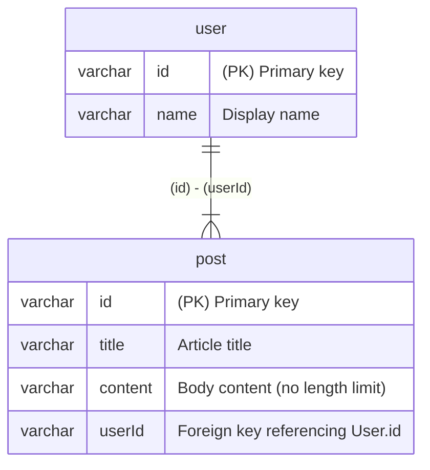

# Sizuku

**[Sizuku](https://www.npmjs.com/package/sizuku)** is a tool that generates validation schemas for Zod and Valibot, as well as ER diagrams, from [Drizzle](https://orm.drizzle.team/) schemas annotated with comments.

## Features

- 💎 Automatically generates [Zod](https://zod.dev/) schemas from your Drizzle schema
- 🤖 Automatically generates [Valibot](https://valibot.dev/) schemas from your Drizzle schema
- 📊 Creates [Mermaid](https://mermaid.js.org/) ER diagrams


## Getting Started

### Installation

```bash
npm install -D sizuku
```

## Usage

### Example

Prepare schema.ts:

```ts
import { mysqlTable, varchar } from 'drizzle-orm/mysql-core'
import { relations } from 'drizzle-orm'

export const user = mysqlTable('user', {
  /// Primary key
  /// @z.uuid()
  /// @v.pipe(v.string(), v.uuid())
  id: varchar('id', { length: 36 }).primaryKey(),
  /// Display name
  /// @z.string().min(1).max(50)
  /// @v.pipe(v.string(), v.minLength(1), v.maxLength(50))
  name: varchar('name', { length: 50 }).notNull(),
})

/// @relation user.id post.userId one-to-many
export const post = mysqlTable('post', {
  /// Primary key
  /// @z.uuid()
  /// @v.pipe(v.string(), v.uuid())
  id: varchar('id', { length: 36 }).primaryKey(),
  /// Article title
  /// @z.string().min(1).max(100)
  /// @v.pipe(v.string(), v.minLength(1), v.maxLength(100))
  title: varchar('title', { length: 100 }).notNull(),
  /// Body content (no length limit)
  /// @z.string()
  /// @v.string()
  content: varchar('content', { length: 65535 }).notNull(),
  /// Foreign key referencing User.id
  /// @z.uuid()
  /// @v.pipe(v.string(), v.uuid())
  userId: varchar('user_id', { length: 36 }).notNull(),
})

export const userRelations = relations(user, ({ many }) => ({
  posts: many(post),
}))

export const postRelations = relations(post, ({ one }) => ({
  user: one(user, {
    fields: [post.userId],
    references: [user.id],
  }),
}))
```

Prepare sizuku.json:

```json
{
  "input": "db/schema.ts",
  "zod": {
    "output": "zod/index.ts",
    "comment": true,
    "type": true
  },
  "valibot": {
    "output": "valibot/index.ts",
    "comment": true
  },
  "mermaid": {
    "output": "mermaid-er/ER.md"
  }
}
```

Run Sizuku:

```sh
npx sizuku
```

### Zod

```ts
import { z } from 'zod/v4'

export const UserSchema = z.object({
  /**
   * Primary key
   */
  id: z.uuid(),
  /**
   * Display name
   */
  name: z.string().min(1).max(50),
})

export type User = z.infer<typeof UserSchema>

export const PostSchema = z.object({
  /**
   * Primary key
   */
  id: z.uuid(),
  /**
   * Article title
   */
  title: z.string().min(1).max(100),
  /**
   * Body content (no length limit)
   */
  content: z.string(),
  /**
   * Foreign key referencing User.id
   */
  userId: z.uuid(),
})

export type Post = z.infer<typeof PostSchema>
```

### Valibot

```ts
import * as v from 'valibot'

export const UserSchema = v.object({
  /**
   * Primary key
   */
  id: v.pipe(v.string(), v.uuid()),
  /**
   * Display name
   */
  name: v.pipe(v.string(), v.minLength(1), v.maxLength(50)),
})

export type User = v.InferInput<typeof UserSchema>

export const PostSchema = v.object({
  /**
   * Primary key
   */
  id: v.pipe(v.string(), v.uuid()),
  /**
   * Article title
   */
  title: v.pipe(v.string(), v.minLength(1), v.maxLength(100)),
  /**
   * Body content (no length limit)
   */
  content: v.string(),
  /**
   * Foreign key referencing User.id
   */
  userId: v.pipe(v.string(), v.uuid()),
})

export type Post = v.InferInput<typeof PostSchema>
```

### Mermaid ER



This project is in **early development** and being maintained by a developer with about 2 years of experience. While I'm doing my best to create a useful tool:

### ⚠️ WARNING: Potential Breaking Changes Without Notice

**This package is in active development and may introduce breaking changes without prior notice.

## License

Distributed under the MIT License. See [LICENSE](https://github.com/nakita628/hono-takibi?tab=MIT-1-ov-file) for more information.