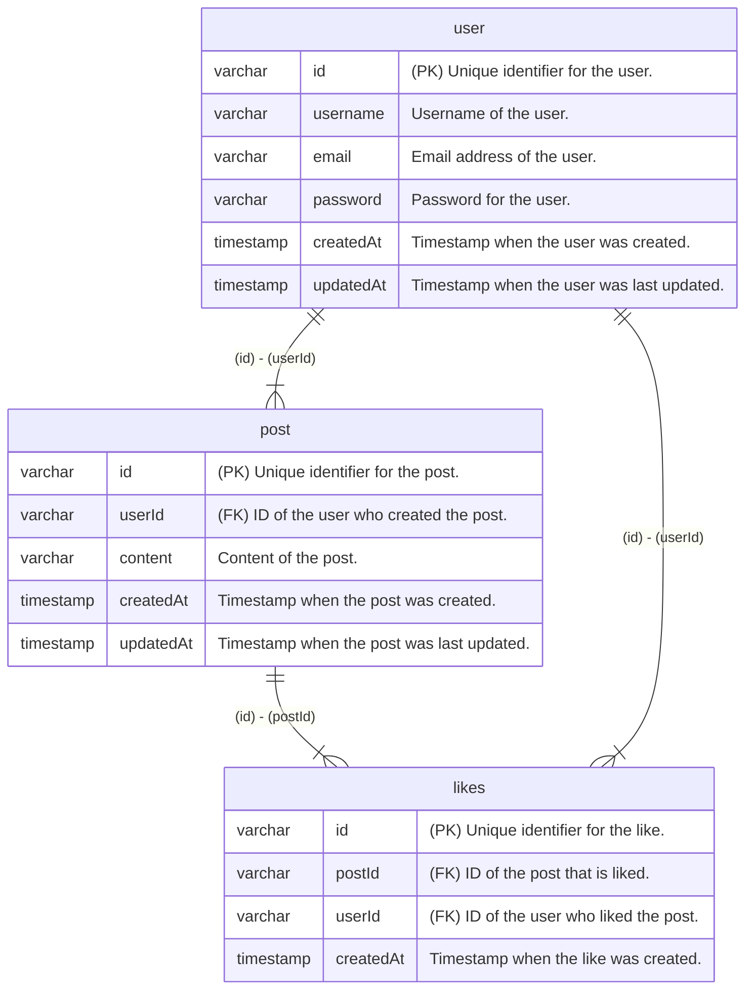

```mermaid
erDiagram
    user ||--}| post : "(id) - (userId)"
    post ||--}| likes : "(id) - (postId)"
    user ||--}| likes : "(id) - (userId)"
    user {
        varchar id "(PK) Unique identifier for the user."
        varchar username "Username of the user."
        varchar email "Email address of the user."
        varchar password "Password for the user."
        timestamp createdAt "Timestamp when the user was created."
        timestamp updatedAt "Timestamp when the user was last updated."
    }
    post {
        varchar id "(PK) Unique identifier for the post."
        varchar userId "(FK) ID of the user who created the post."
        varchar content "Content of the post."
        timestamp createdAt "Timestamp when the post was created."
        timestamp updatedAt "Timestamp when the post was last updated."
    }
    likes {
        varchar id "(PK) Unique identifier for the like."
        varchar postId "(FK) ID of the post that is liked."
        varchar userId "(FK) ID of the user who liked the post."
        timestamp createdAt "Timestamp when the like was created."
    }
```